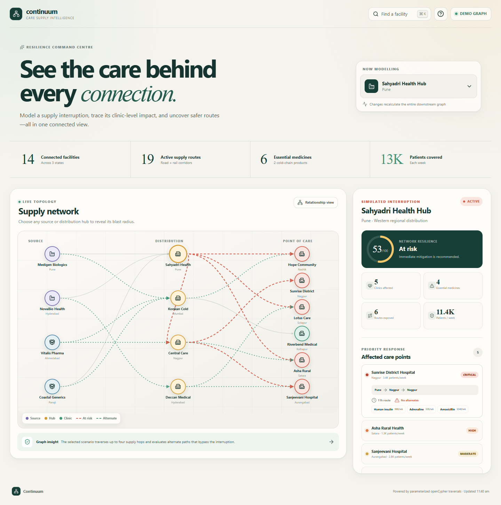
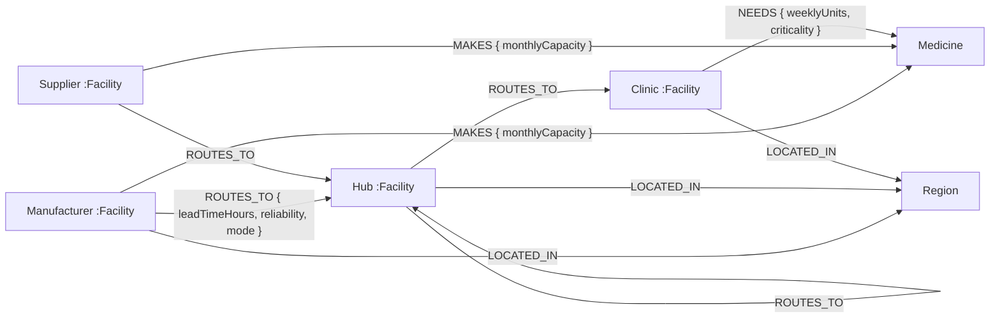
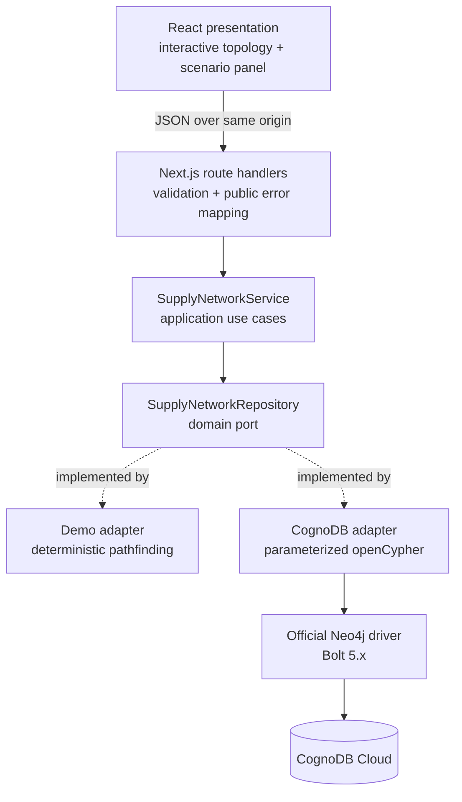

# Continuum

**Medicine supply resilience, understood as a graph.**

Continuum helps healthcare operations teams answer a difficult question quickly: _if this supplier or distribution hub fails today, which clinics and medicines are at risk—and what can we do next?_



The application is built for [CognoDB](https://cognodb.com/docs), uses the official Neo4j JavaScript driver over Bolt, and includes a zero-setup demo adapter so the complete experience can be reviewed before cloud credentials are configured.

## What makes the demo compelling

- **One clear workflow:** select a source or hub, see the downstream blast radius, then inspect safer routes.
- **Genuinely graph-native analysis:** variable-length paths trace up to four supply hops; alternate paths must cover an exposed clinic/medicine pair while bypassing the failed facility.
- **Purposeful UX:** command-palette search (`Ctrl/Cmd + K`), interactive SVG topology, risk-ranked clinics, route provenance, responsive layout, and explicit loading, empty, and error states.
- **Production-minded boundaries:** domain policy, application use case, repository port, CognoDB and demo adapters, composition root, and thin HTTP handlers.
- **Safe database access:** every runtime and seed value is passed as a Cypher parameter. Secrets are environment-only.

## Why a graph database?

The central questions are about paths, not records:

- Which clinics are reachable downstream from a failed hub through one to four `ROUTES_TO` relationships?
- Which essential medicines are demanded at those clinics?
- Is there another manufacturer-to-clinic path that supplies the same medicine without touching the failed node?
- How does risk change as routes and facilities are added?

In a relational design, the first query requires recursive CTEs over a self-referencing routes table. The alternate-route query then combines recursive traversal, cycle prevention, route-property aggregation, medicine compatibility, and an exclusion constraint. The result is possible, but harder to express, optimize, and explain.

In the graph, the business question and query have the same shape:

```cypher
MATCH path = (disrupted:Facility {id: $facilityId})-[:ROUTES_TO*1..4]->(clinic:Clinic)
RETURN clinic, nodes(path), relationships(path)
```

Adding another transfer hub changes the data, not the query. That is where the graph earns its place.

## Data model



All application nodes also carry the `:Continuum` label so the seed script can reset only this bounded dataset. Facility IDs, medicine IDs, and region IDs are protected by uniqueness constraints.

The realistic synthetic dataset contains 14 facilities, 6 medicines, 19 routes, 9 production relationships, and 17 clinic demand relationships across western and central India.

## Architecture



The dependency direction points inward: the domain does not import Next.js, Neo4j, or React. The live and demo implementations honor the same repository contract, so the use case and UI do not change when the database adapter changes.

See [the architecture notes](./docs/architecture.md) for request flow, decisions, and trade-offs.

## Project structure

```text
src/
├── app/                         # Next.js pages and HTTP route handlers
├── application/                # Framework-free use-case orchestration
├── components/                 # Accessible presentation components
├── domain/                     # Entities, repository port, risk policy
├── infrastructure/
│   ├── config/                 # Validated environment configuration
│   ├── demo/                   # Seed fixture + local graph traversal
│   └── graph/                  # Driver lifecycle, Cypher, CognoDB adapter
└── lib/                         # Public errors and browser API client
scripts/seed.ts                  # Transactional, parameterized seed loader
docs/                           # Architecture, screenshots, demo script
```

## Run locally in two minutes

Requirements: Node.js 22 or newer and npm.

```bash
npm install
cp .env.example .env.local
npm run dev
```

Open [http://localhost:3000](http://localhost:3000). The checked-in example uses `DATA_SOURCE=demo`, so no account or database is required for this first run.

### Connect CognoDB Cloud

1. Create an account at [console.cognodb.com/signup](https://console.cognodb.com/signup).
2. Create a free `c0` instance and choose a nearby region.
3. Copy the generated password immediately; it is shown once.
4. Update `.env.local`:

```dotenv
DATA_SOURCE=cognodb
COGNODB_URI=bolt+s://your-instance-id.databases.cognodb.cloud
COGNODB_USERNAME=cognodb
COGNODB_PASSWORD=your-password
COGNODB_DATABASE=neo4j
```

5. Load the graph and start the application:

```bash
npm run seed
npm run dev
```

The seed runs in a managed transaction. It deletes only nodes labeled `:Continuum`, recreates the realistic fixture, and never interpolates fixture values into query text.

> If your managed instance provides a database name other than `neo4j`, use that value for `COGNODB_DATABASE`.

## Main graph queries

### 1. Multi-hop blast radius

`impactPaths` starts at the parameterized disrupted facility and follows one to four directed supply routes. The adapter selects the lowest-lead-time path per clinic and aggregates all exposed path relationships.

### 2. Medicine exposure

`clinicNeeds` connects impacted clinics to medicines through `NEEDS`. For a manufacturer or supplier failure, exposure is narrowed to the medicines that facility `MAKES`; for a hub failure, every downstream demand is considered.

### 3. Alternate route discovery

`alternativePaths` joins the exposed clinic and medicine to another producing facility, then performs another variable-length traversal to the clinic. The adapter rejects any returned path containing the disrupted node and ranks the remaining paths by cumulative reliability and lead time.

All query text is centralized in [`queries.ts`](./src/infrastructure/graph/queries.ts), making parameter boundaries straightforward to audit.

## Reliability and failure behavior

- The Neo4j `Driver` is created once and shared; sessions are short-lived and always closed.
- Reads use managed transactions, which receive the driver's transient-error retry behavior.
- Connection, acquisition, and retry windows are bounded to prevent a hanging interface.
- Invalid facility IDs are rejected at the HTTP boundary before they reach the repository.
- Database errors become a stable `503 DATABASE_UNAVAILABLE` response without exposing credentials or driver internals.
- The UI has distinct network-level and scenario-level recovery screens with retry actions.
- Demo mode is explicit; it never silently replaces a failed live database.

## Verification

```bash
npm run lint       # ESLint + Next.js rules
npm run typecheck  # strict TypeScript
npm test           # domain, config, and graph-adapter behavior
npm run build      # optimized production build

# or run everything
npm run check
```

The test suite covers risk policy, resilience scoring, multi-hop disruption traversal, medicine scoping, invalid scenarios, and environment validation.

## Deploy

The project is ready for any Node-compatible Next.js host. On Vercel:

1. Import the GitHub repository.
2. Add the five environment variables shown above.
3. Deploy using the detected Next.js defaults.
4. Run `npm run seed` once from a trusted machine against the same CognoDB instance.
5. Verify `/api/health` returns `source: "cognodb"` before sharing the link.

Keep `COGNODB_PASSWORD` server-side; it is intentionally never prefixed with `NEXT_PUBLIC_`.

## Recording the submission

A focused 90-second walkthrough is outlined in [`docs/DEMO_SCRIPT.md`](./docs/DEMO_SCRIPT.md). It demonstrates the user story first, then briefly proves the graph model, parameterized Cypher, seed script, and graceful database error handling.

## Design notes

- The interface uses a custom responsive SVG instead of a large graph-visualization dependency. The dataset is small and curated, so deterministic columns communicate flow more clearly and keep the client bundle lean.
- Patient coverage is modeled as weekly clinic throughput, not a claim about individual patient records.
- The dataset is realistic but synthetic; no protected health information is stored.
- Demo traversal is intentionally limited to four hops, matching the live Cypher and the bounded nature of the c0 dataset.

---

Built as the Wexa AI CognoDB take-home assignment. Every architectural decision and query is intended to be explainable in a line-by-line review.
